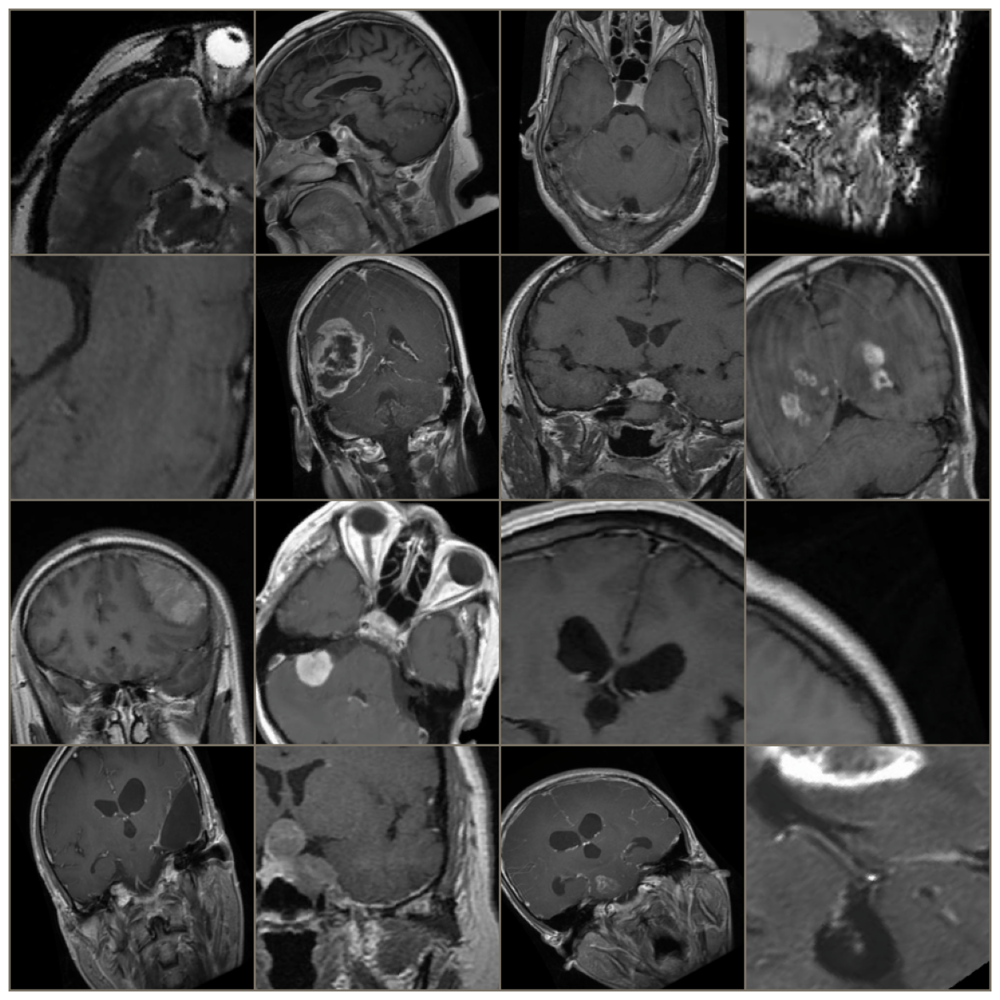
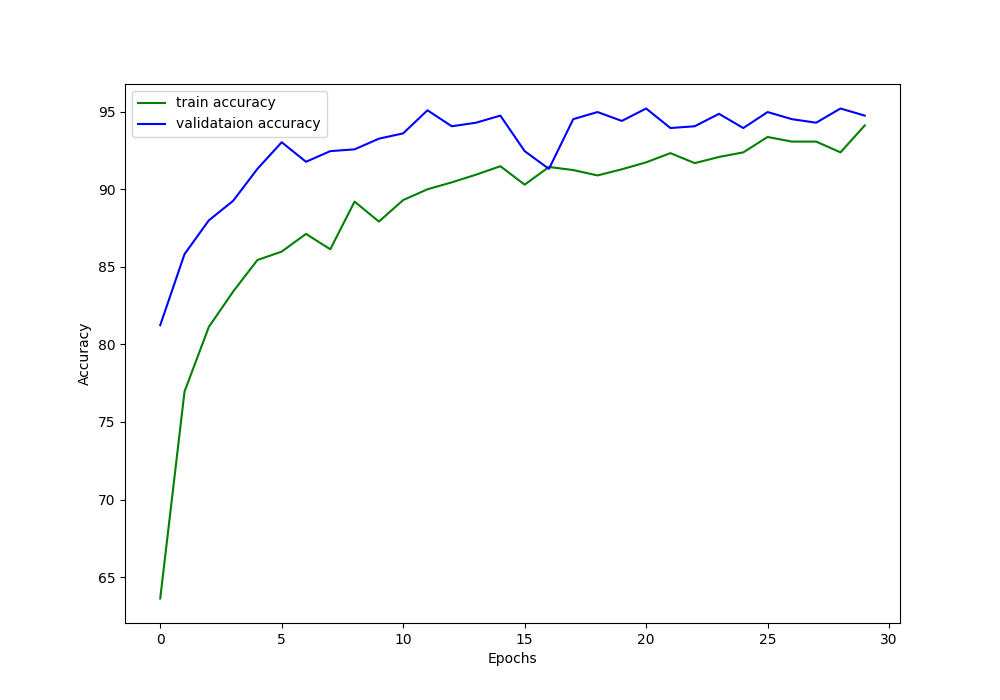
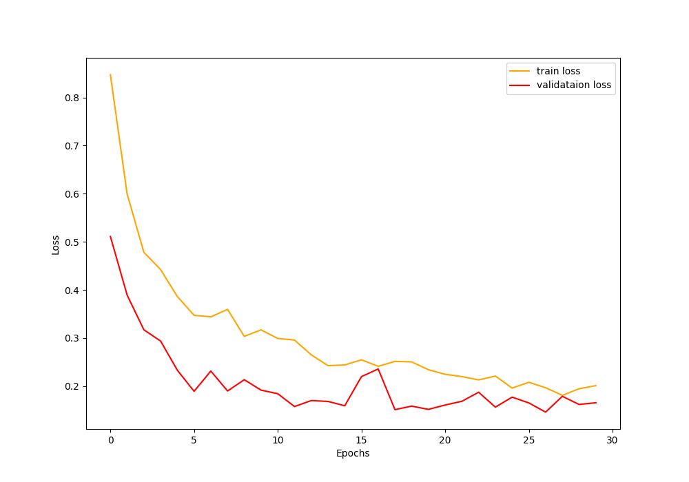

# Brain Tumor Classification Project

This repository contains a machine learning project that focuses on classifying brain tumors (glioma, meningioma, pituitary tumor, no tumor ). This project aims to demonstrate that we could create AI tools to boost brain classifications to give better attention to our patients. The machine learning model developed in this project utilizes the pre-trained ResNet architecture to achieve accurate classifications (96.33% accuracy).

## Installation

To use this project, follow these steps:

1. Clone the repository:

   ```shell
   git clone https://github.com/z0CoolCS/braintumor_classification.git
   ```
2. Download the dataset from:

  > https://www.kaggle.com/datasets/sartajbhuvaji/brain-tumor-classification-mri?datasetId=672377&sortBy=voteCount

## Project Structure

The repository is structured as follows:

```
├── main.py
├── train.py
├── data.py
├── resnet.py
├── utils.py
├── resnet_demo.ipynb
└── README.md
```

- **main.py**: Contains initial code execution. You should execute this file in order to train new models.
- **resnet/train.py**: Contains functions for the training, validation, and testing stage.
- **resnet/data.py**: Contains code to load and transform the dataset.
- **resnet/resnet.py**: Contains the model implementation for the ResNet architecture.
- **resnet/utils.py**: Contains code related to ploting and saving the model.
- **README.md**: The current file providing an overview of the project.

## Results




The model achieved 96.33 accuracy with the test dataset. 

## Contributing

Contributions to this project are welcome! If you encounter any issues or have suggestions for improvements, please open an issue or submit a pull request. 

## References

Include any relevant references or resources that were used in the development of this project.

---
